# Air Quality Forecasting

**Benchmarking deep learning vs. classical ML for multi-horizon PM2.5 prediction on the Beijing Multi-Site Air Quality dataset.**


---

## Table of Contents

- [Context \& Objective](#context--objective)
- [Methodology](#methodology)
  - [Data Preparation](#data-preparation)
  - [Feature Engineering by Model Type](#feature-engineering-by-model-type)
  - [Models Compared](#models-compared)
  - [Hyperparameter Optimization](#hyperparameter-optimization)
- [Key Results](#key-results)
- [Random Forest Feature Importance](#random-forest-feature-importance)
- [Residual Analysis](#residual-analysis)
- [Cross-Station Generalization](#cross-station-generalization)
- [Limitations \& Future Work](#limitations--future-work)
- [Reproducibility](#reproducibility)
- [License](#license)

---

## Context & Objective

Fine particulate matter (PM2.5) is one of the most critical air pollutants affecting public health. Particles smaller than 2.5 µm penetrate deep into the lungs and bloodstream, contributing to cardiovascular and respiratory diseases. Accurate short-term forecasting of PM2.5 concentrations could enable early warnings and inform public health decisions.

This project uses the [Beijing Multi-Site Air Quality dataset](https://archive.ics.uci.edu/dataset/501/beijing+multi+site+air+quality+data) from the UCI Machine Learning Repository:

- **12 monitoring stations** across Beijing (urban, suburban, rural)
- **4 years** of hourly measurements (March 2013 – February 2017)
- **~35,000 hourly records** per station
- Features include pollutants (SO2, NO2, CO, O3) as well as meteorological variables (temperature, pressure, dew point, wind speed/direction, rainfall)

### Design Choices

- **PM10 excluded from features**: PM10 (particles < 10 µm) is a superset of PM2.5 by definition. Including it would introduce a definitional overlap that inflates apparent model performance without adding predictive signal.
- **Aotizhongxin as reference station**: all models are trained exclusively on Aotizhongxin, a representative urban station, then evaluated for spatial generalization across all 12 stations.
- **Prediction horizon**: 6 hours ahead (t+1 through t+6), providing an actionable forecasting window for public health alerts.

---

## Methodology

### Data Preparation

Strict protocols are followed to prevent data leakage and respect the temporal nature of the data:

1. **Forward-fill** missing values (`ffill`) applied *before* splitting - avoids look-ahead leakage from interpolation methods that use future values.
2. **Temporal split** (70/15/15) - training, validation, and test sets are sliced chronologically. No shuffling, which would break temporal causality.
3. **StandardScaler** fit exclusively on the training set - validation and test sets are transformed using training statistics only.
4. **Cyclical encoding** for hour and month - `sin/cos` transforms so the model understands that hour 23 wraps to hour 0, and December wraps to January.
5. **One-hot encoding** for wind direction - a categorical variable with no ordinal relationship.

### Feature Engineering by Model Type

Different model architectures require different input representations:

| Aspect | Random Forest | LSTM / Transformer |
|---|---|---|
| **Input structure** | Flat vector with explicit lag features | Sliding window of raw time steps |
| **Lag features** | `PM2.5_lag_{1,2,3,6,12,24}` | Not needed - the model learns temporal dependencies directly from the sequence |
| **Target** | `PM2.5_t+1` through `PM2.5_t+6` (multi-output) | 6-step horizon vector |
| **Target transform** | StandardScaler | `log1p` -> StandardScaler |
| **Window size** | N/A | Tuned via Optuna (LSTM: 6h, Transformer: 12h) |

PM2.5 has a heavy-tailed distribution with occasional extreme spikes. Training on raw values causes the loss to be dominated by high-concentration events, while the model underperforms on typical values. Applying `log1p` compresses the scale asymmetrically, forcing the model to allocate representational capacity more evenly across the concentration range, improving RMSE on both normal and extreme episodes.

### Models Compared

Four models are benchmarked, chosen to span the complexity spectrum:

| Model | Role | Key Properties |
|---|---|---|
| **Naive (Persistence)** | Baseline | Predicts the current PM2.5 value for all future horizons. Any model failing to beat this adds no value. |
| **Random Forest** | Classical ML | Handles non-linear relationships without explicit temporal modeling. |
| **LSTM** | Sequential deep learning | Learns temporal dependencies through gated memory cells. |
| **Transformer** | Attention-based deep learning | Self-attention mechanism that can model long-range dependencies. |

### Hyperparameter Optimization

Deep learning models are tuned using **Optuna** with Bayesian optimization:

- **Trials**: 40 per model
- **Pruning**: `MedianPruner` (7 startup trials, 10 warmup steps)
- **Early stopping**: patience of 10 epochs during training within each trial
- **Hyperparameters space**: chosen after iterations to focus search on promising regions
  
**Tuned hyperparameters:**

| Hyperparameter | LSTM Search Space | Best | Transformer Search Space | Best |
|---|---|---|---|---|
| Learning rate | `[1e-6, 1e-2]` (log) | 1.19e-4 | `[1e-6, 1e-2]` (log) | 1.15e-4 |
| Hidden / d_model | `{16, 32, 64, 128}` | 64 | `{32, 64, 128}` | 32 |
| Num layers | `[1, 4]` | 1 | `[1, 3]` | 1 |
| Dropout | `[0.3, 0.5]` | 0.46 | `[0.3, 0.6]` | 0.30 |
| Window size | `{6, 12, 18, 24}` | 6 | `{12, 18, 24, 30}` | 12 |
| Attention heads | - | - | `{1, 2, 4, 8}` | 8 |

**Random Forest** uses `GridSearchCV` with 5-fold cross-validation over `n_estimators`, `max_depth`, `min_samples_split`, `min_samples_leaf`, and `max_features`. Unlike the deep learning models, the RF search space is small and fully discrete (108 combinations), making exhaustive grid search practical — every configuration is evaluated, guaranteeing the optimum is found without relying on sampling heuristics.

<p align="center">
  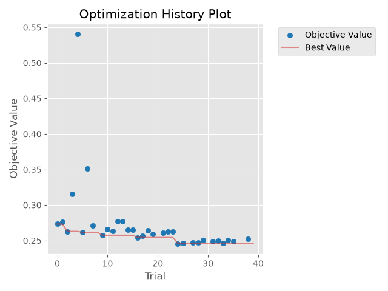
  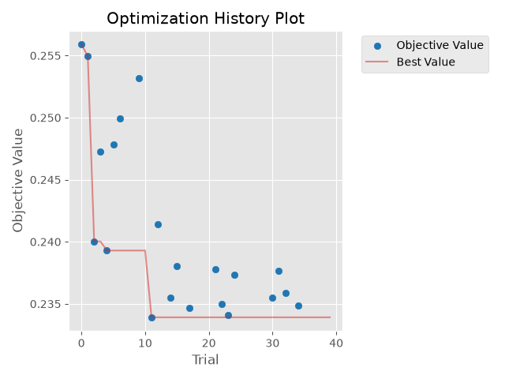
</p>
<p align="center"><em>Optuna optimization history - LSTM (left) vs Transformer (right)</em></p>

<p align="center">
  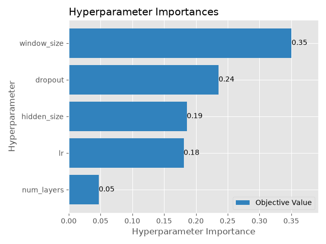
  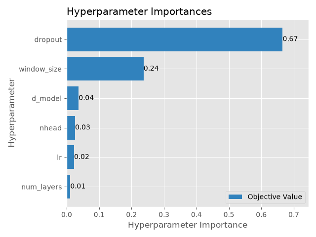
</p>
<p align="center"><em>Hyperparameter importance - LSTM (left) vs Transformer (right)</em></p>

---

## Key Results

All models are evaluated on the Aotizhongxin test set (last 15% of the time series). Metrics are averaged across the 6 prediction horizons (t+1 through t+6).

| Rank | Model | RMSE (µg/m³) | MAE (µg/m³) |
|:---:|---|:---:|:---:|
| 1 | **Random Forest** | **41.70** | **22.93** |
| 2 | Transformer | 43.38 | 23.59 |
| 3 | LSTM | 45.22 | 25.51 |
| 4 | Naive (Persistence) | 46.27 | 24.77 |

<p align="center">
  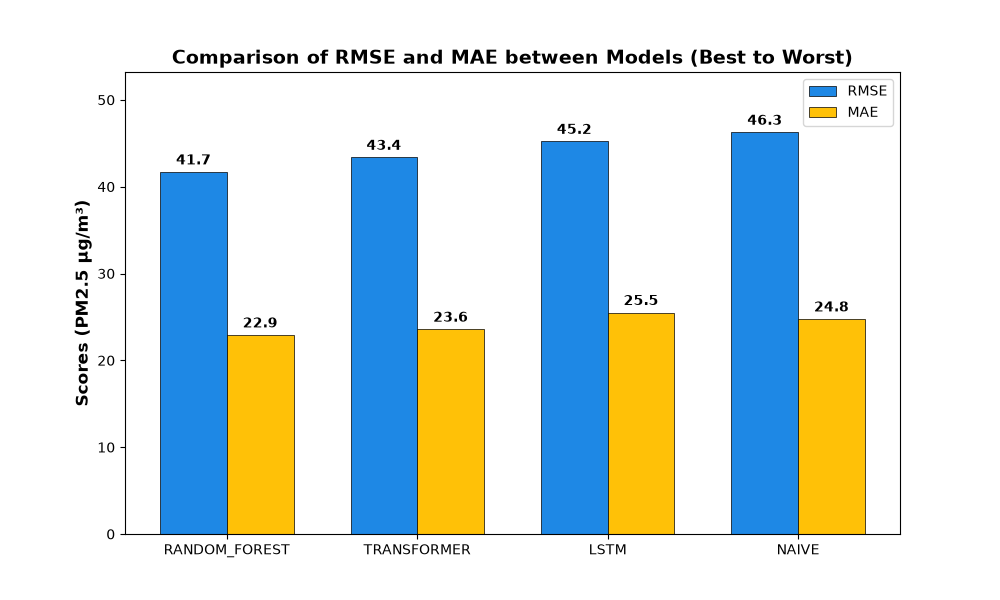
</p>
<p align="center"><em>RMSE and MAE comparison (sorted best to worst)</em></p>

Breaking down performance by individual prediction horizon (t+1 through t+6) reveals how each model degrades as the forecast window extends:
<p align="center">
  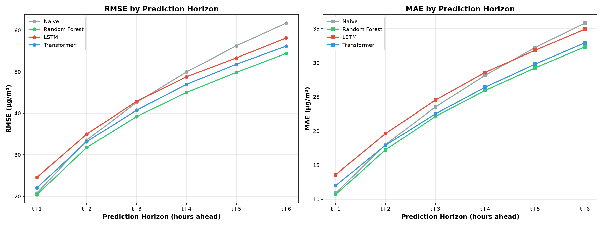
</p>

<p align="center"><em>Per-horizon RMSE (left) and MAE (right) - all models degrade with horizon, but at different rates</em></p>
 Random Forest maintains its lead across all 6 horizons. The LSTM starts with the worst t+1 error (~25 µg/m³ vs ~20 for RF) but start beating the naive baseline at t+4 for MAE and t+3 for RMSE.


**Main observations:**

- **Random Forest dominates**, beating all deep learning models. Tree-based models with well-engineered lag features can outperform deep learning architectures on time-series forecasting tasks, especially on moderate-sized datasets. Source: https://arxiv.org/abs/2207.08815
- **Transformer outperforms LSTM**.
- **LSTM barely beats the naive baseline** on RMSE (45.22 vs 46.27) while performing worse 
  on MAE. Combined with the residual analysis below (systematic underprediction of spikes, 
  shifted prediction curve on non-peak pollution hours), this points to a "delayed follower" 
  behavior: rather than actively forecasting changes, the model appears to lag behind 
  the true signal by a few hours.
- The LSTM's Optuna-selected window size of only 6 hours (vs 12 for the Transformer) suggests it struggles to leverage longer context.

<p align="center">
  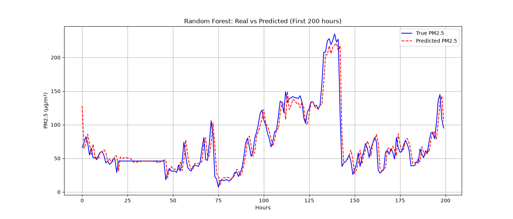
  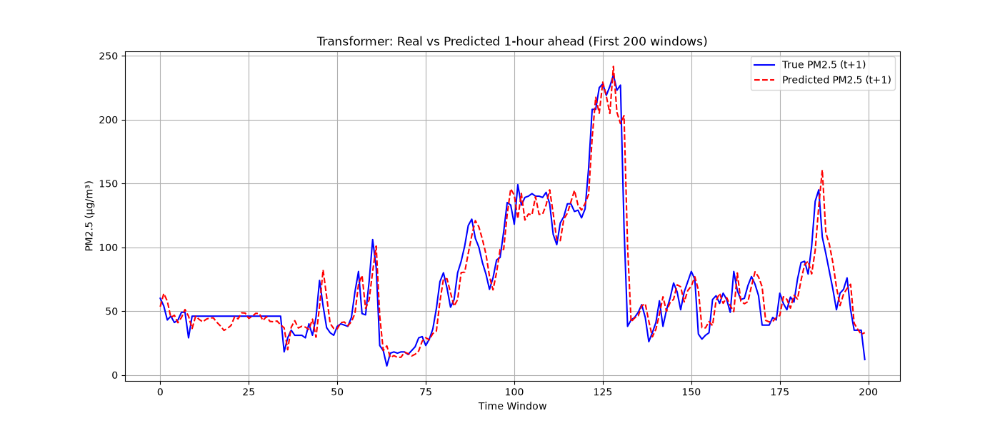
</p>
<p align="center">
  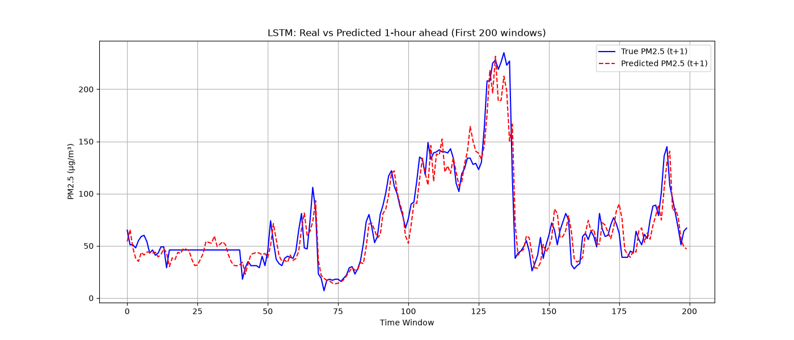
  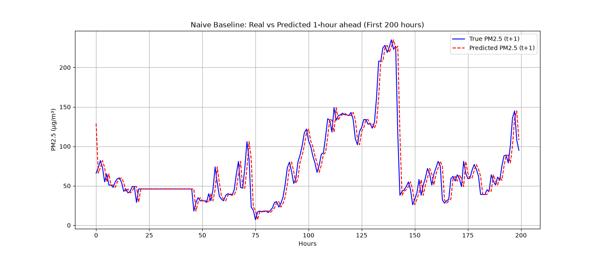
</p>
<p align="center"><em>Predictions vs ground truth (first 200 hours of test set) - RF (top-left), Transformer (top-right), LSTM (bottom-left), Naive (bottom-right)</em></p>

<p align="center">
  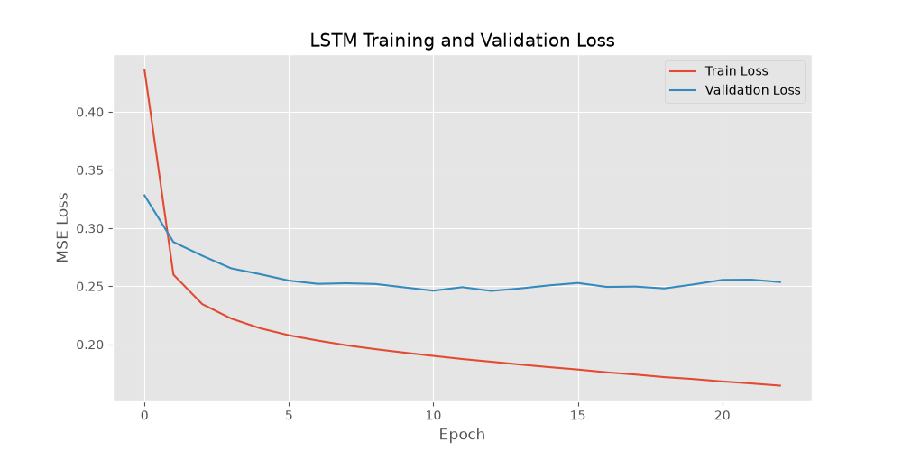
  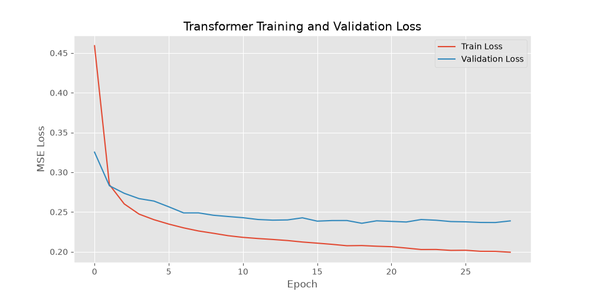
</p>
<p align="center"><em>Training and validation loss curves - LSTM (left) vs Transformer (right)</em></p>

---

## Random Forest Feature Importance

The Random Forest provides a built-in ranking of the most predictive features. This transparency is a major advantage over neural network models.

<p align="center">
  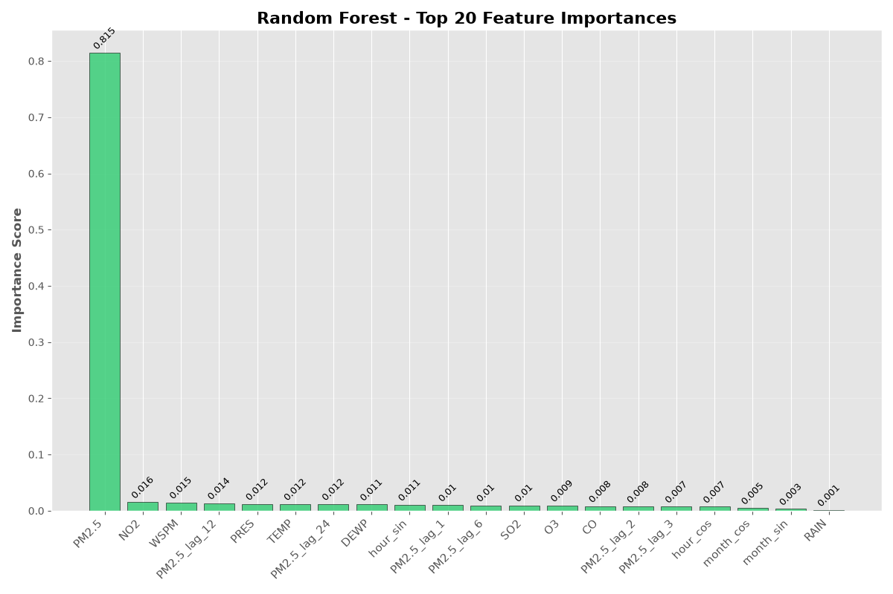
</p>
<p align="center"><em>Top 20 feature importances (MDI - Mean Decrease in Impurity)</em></p>

- **Recent PM2.5 lags dominate** (`PM2.5_lag_1`, `PM2.5_lag_2`, `PM2.5`) - the strongest predictor of PM2.5 is its own recent past, which is not surprising for a highly autocorrelated process.
- **CO is the top non-PM2.5 feature** - CO and PM2.5 share common combustion sources (vehicles, heating), making it a strong proxy.
- **Meteorological features** (dew point, temperature, pressure) carry meaningful signal, confirming that atmospheric conditions influence particulate dispersion.
- **Cyclical time features** (`hour_sin`, `hour_cos`) appear in the top 20, validating the cyclical encoding strategy.

---

## Residual Analysis

Residual analysis goes beyond aggregate metrics to diagnose *how* and *why* each model fails. All plots show the 1-hour-ahead prediction (t+1).

### Residuals vs True Value (Heteroscedasticity)

<p align="center">
  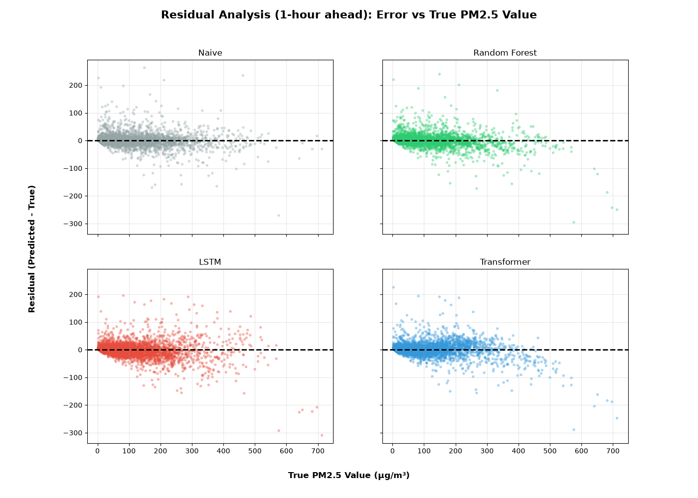
</p>
<p align="center"><em>Residuals (predicted − true) vs true PM2.5 value</em></p>

- The **LSTM** shows a strong **negative bias at high concentrations** (residuals trending below zero for true values > 300 µg/m³). This means it systematically underpredicts pollution spikes. This could be a dangerous failure mode for a health-warning system.
- The **Random Forest** shows the tightest residual band, with relatively symmetric errors.

### Residual Distribution

<p align="center">
  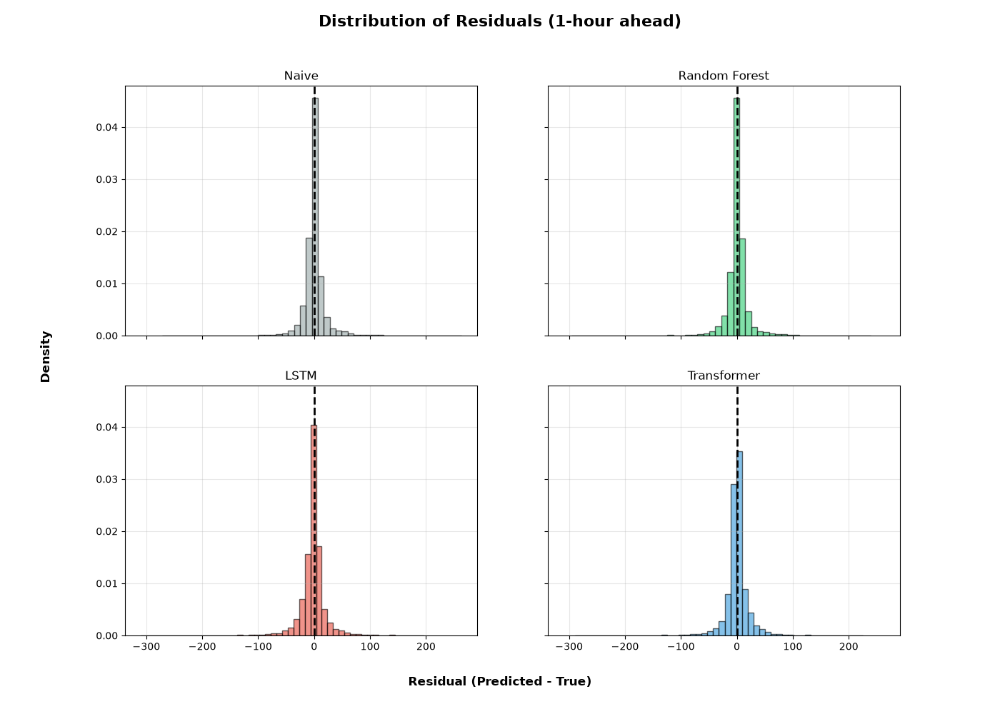
</p>
<p align="center"><em>Distribution of residuals (density)</em></p>

- The **Random Forest** has the sharpest, most symmetric distribution.
- The **LSTM** distribution has a heavier negative tail, confirming the systematic underprediction of high values.
- Both deep learning models show heavier tails than RF, indicating greater sensitivity to extreme events.

### Autocorrelation of Residuals

<p align="center">
  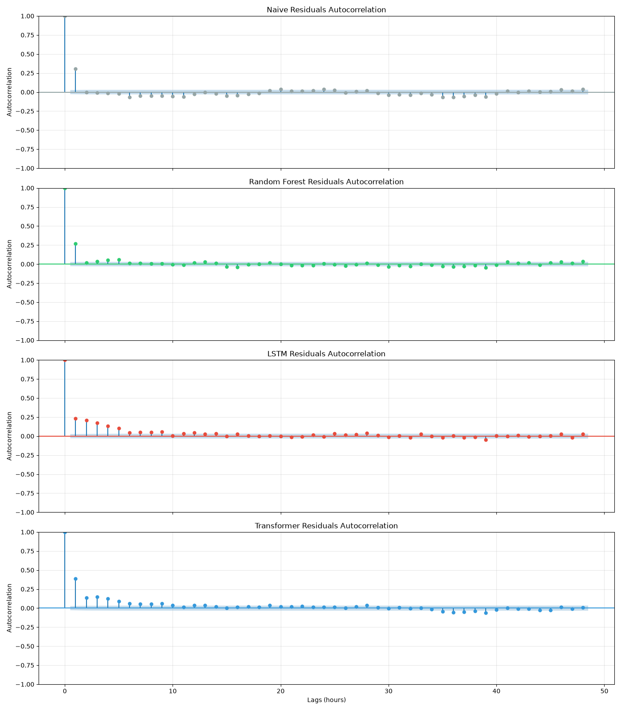
</p>
<p align="center"><em>Autocorrelation function of residuals (up to 48 lags = 48 hours)</em></p>


- **Naive and Random Forest residuals are close to white noise**: autocorrelation drops 
  near zero within 2-3 lags, meaning these models extract essentially all the exploitable 
  short-term signal - little structure is left unexplained.
- **The LSTM shows strong, slowly-decaying autocorrelation**: a high correlation at lag 1 
  that only returns within the confidence band after several hours. The model's errors are correlated, meaning 
  the model has not fully captured all the temporal dependencies.
- **The Transformer sits between RF and LSTM**: its autocorrelation decays faster than 
  the LSTM's but not as sharply as RF's, suggesting attention captures more of the 
  short-term dynamics than the LSTM but not as well as the Random Forest.

---

## Cross-Station Generalization

A key test of model robustness: models trained on **Aotizhongxin only** are evaluated on all 12 stations **without retraining**. Stations are grouped by typology (urban, suburban, rural).

<p align="center">
  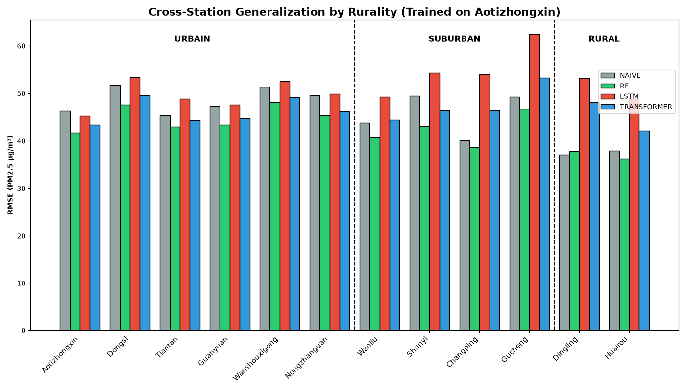
</p>
<p align="center"><em>RMSE across all 12 stations, grouped by urban / suburban / rural typology</em></p>

**Key findings:**

- **The model ranking is stable across urban stations**: Random Forest consistently leads, followed by Transformer, then LSTM and Naive. This suggests the learned patterns generalize well within similar pollution regimes.
- **In suburban stations (Wanliu, Shunyi), the performance gap widens**: the Random Forest's advantage increases on these more complex sites and the LSTM performance is degraded most significantly.
- **In rural stations (Dingling, Huairou), the performance gap narrows considerably**: the Naive baseline nearly matches the Random Forest.
- **The LSTM suffers the most from domain shift**: its RMSE degrades significantly on out-of-distribution stations. This aligns with its lower capacity and "follower" behavior.
- The Transformer shows more **graceful degradation** across stations than the LSTM, suggesting its attention mechanism captures more generalizable patterns.

---

## Limitations & Future Work

This project has several known limitations that present opportunities for future improvement:

1. **No multivariate vs. autoregressive ablation**: it remains unclear how much predictive power comes from exogenous features (weather, pollutants) vs. the target's own history. An ablation study would quantify this.

2. **Single-station training**: while the spatial generalization test is informative, a multi-station or station-aware training scheme could further improve performance.

3. **No evaluation on future target variables**: While we evaluate on $PM_{2.5}$, we do not evaluate the model's ability to predict future values of other variables (e.g. CO, $O_3$, $\text{SO}_2$, $\text{NO}_2$) using current or past values of all available variables.

4. **Extreme value prediction**: No explicit evaluation of extreme value prediction was performed. Future work could extend the evaluation to include metrics that specifically target the model's ability to predict extreme values.

5. **Single-seed training**: models are trained with a single random seed. While the overall ranking (RF > Transformer > LSTM ≈ Naive) shows large enough margins to be robust, multi-seed runs would strengthen these claims.

---

## Reproducibility

### Repository Structure

```
air-quality-forecasting/
├── data/
│   └── raw/                          # Raw CSV files (gitignored, download via script)
├── notebooks/
│   └── 01_exploration.ipynb          # Exploratory data analysis
├── src/
│   ├── data.py                       # Data loading, preprocessing, feature engineering
│   ├── train.py                      # Full training pipeline (RF + LSTM + Transformer)
│   ├── evaluate.py                   # Generate all evaluation figures
│   ├── cross_station_eval.py         # Cross-station generalization evaluation
│   ├── download_data.sh              # Script to download raw data from UCI
│   └── models/
│       ├── baselines.py              # Random Forest with GridSearchCV
│       ├── lstm.py                   # LSTM model, training loop, Optuna tuning
│       └── transformer.py            # Transformer model, training loop, Optuna tuning
├── results/
│   ├── figures/                      # All generated plots
│   │   ├── metrics/                  # Metrics comparison, cross-station
│   │   ├── predictions/             # Prediction vs true plots, horizon analysis
│   │   └── residuals/               # Scatter, histogram, autocorrelation
│   ├── metrics.json                  # RMSE/MAE for all models (Aotizhongxin)
│   ├── cross_station_metrics.json    # RMSE/MAE across all 12 stations
│   ├── lstm_best_params.json         # Best LSTM hyperparameters from Optuna
│   └── transformer_best_params.json  # Best Transformer hyperparameters from Optuna
├── requirements.txt
├── LICENSE
└── README.md
```

### Setup

```bash
# Clone the repository
git clone https://github.com/TomSchippke/air-quality-forecasting.git
cd air-quality-forecasting

# Create and activate a virtual environment
python -m venv env
source env/bin/activate

# Install dependencies
pip install -r requirements.txt

# Download the dataset
bash src/download_data.sh
```

### Running the Pipeline

```bash
# Step 1: Train all models (RF + LSTM + Transformer) and compute metrics
python -m src.train

# Step 2: Generate all evaluation figures (predictions, residuals, comparisons)
python -m src.evaluate

# Step 3: Run cross-station generalization evaluation
python -m src.cross_station_eval
```

> **Note**: Training includes Optuna hyperparameter tuning, which can take several hours depending on hardware. Set `TUNE_LSTM = False` and `TUNE_TRANSFORMER = False` in `src/train.py` to skip tuning and use saved parameters.

---

## License

This project is licensed under the MIT License - see [LICENSE](LICENSE) for details.
